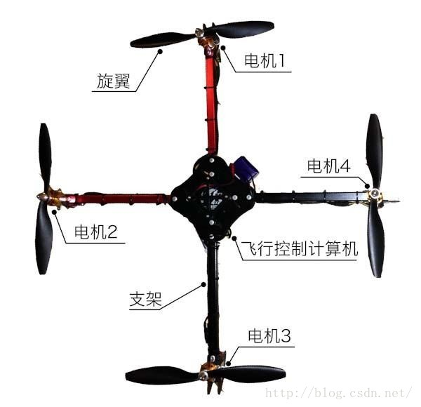
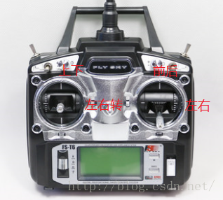

# APM飞控学习之路：1 无人机的分类与发展

2016年10月28日 20:13:18 [岳小飞Fly](https://me.csdn.net/u010682510) 阅读数：8521 标签： [无人机 行业 发展](https://so.csdn.net/so/search/s.do?q=%E6%97%A0%E4%BA%BA%E6%9C%BA%20%E8%A1%8C%E4%B8%9A%20%E5%8F%91%E5%B1%95&t=blog) 更多

个人分类： [四旋翼无人机](https://blog.csdn.net/u010682510/article/category/6495885)

版权声明：本文为博主原创文章，未经博主允许不得转载。 https://blog.csdn.net/u010682510/article/details/52959495

        “旧时王谢堂前燕，飞入寻常百姓家”。无人机也像那堂前燕，从以前为军事所专属，负责侦查和战斗，飞入民用领域，在航拍、植保、快递、救灾、巡检、拍摄等行业大显身手，无人机+的应用遍地开花，成为智能时代机器人领域的尖兵。

        无人机，顾名思义，即不载人的飞行器。目前飞行器主要分为3类：固定翼（fixed wing）；直升机（helicopter）；多旋翼（multi-rotor）。最近风头最热、也最有前景的，当属多旋翼大家族的主力军——四旋翼无人机（quadcopter），大大小小的无人机厂商如雨后春笋般冒出来。大的有DJI、零度、亿航、极飞等，小的就数不胜数了，最近京东也众筹了一款PowerEgg无人机，无人机行业的繁荣可见一斑。各飞行器的特点简介如下：

<table width="100%" cellspacing="0" cellpadding="0" border="1"><tbody><tr><td valign="top">
<strong>飞行器分类</strong>
</td><td valign="top">
<strong>固定翼</strong>
</td><td valign="top">
<strong>直升机</strong>
</td><td valign="top">
<strong>多旋翼</strong>
</td></tr><tr><td valign="top">
<strong>稳定性</strong>
</td><td valign="top">
自稳定
</td><td valign="top">
不稳定，完整驱动
</td><td valign="top">
不稳定，欠驱动
</td></tr><tr><td valign="top">
<strong>续航时间</strong>
</td><td valign="top">
长
</td><td valign="top">
中
</td><td valign="top">
短
</td></tr><tr><td valign="top">
<strong>飞行效率</strong>
</td><td valign="top">
高
</td><td valign="top">
中
</td><td valign="top">
低
</td></tr><tr><td valign="top">
<strong>载荷</strong>
</td><td valign="top">
大
</td><td valign="top">
中
</td><td valign="top">
小
</td></tr><tr><td valign="top">
<strong>其他</strong>
</td><td valign="top">
起飞助跑，降落滑行
</td><td valign="top">
可垂直起降，机械结构复杂
</td><td valign="top">
可垂直起降，机械结构简单 &nbsp; &nbsp; &nbsp; &nbsp;
</td></tr></tbody></table>

  

         本系列博客的重点也是四旋翼无人机。四旋翼含4个螺旋桨，即4个电机，4个自由度，而三维空间的位姿有6个自由度，4<6，因而称欠驱动。受控的自由度可以从遥控器的输入看出端倪：左边的摇杆控制上下的高度和机头的朝向（Yaw），右边的摇杆控制飞机的前后和左右，共4个自由度。而欠驱动的2个自由度为飞机的俯仰（Pitch）和横滚（Roll），和飞机的前后、左右是耦合的，因此也可以说右边的摇杆控制飞机的俯仰和横滚。无人机在前后左右运动时机身会产生一定倾斜的原因即在于此。

  

        上表大致总结了各飞行器的特点，那么问题来了，多旋翼各项指标落后仍受大众青睐到底为哪般？让我们走近科学，探秘多旋翼。由于多旋翼系统不稳定、欠驱动，需要自动控制器来控制飞行器的姿态，而要取得姿态，就不得不提惯性导航系统（Inertial Navigation System，以下简称INS）。INS的主要原理是利用加速度计和陀螺仪，对时间积分获得速度，进而获得飞行器的位置和姿态。INS最初用于导弹、火箭等军事领域，十几公斤的大铁疙瘩对于按吨计的巨型铁疙瘩来说那都不算事儿。但要放到多旋翼头上，这可是泰山压顶，愚公有心也无力，多旋翼的研究一度停滞。  

        到了上世纪90年代，随着微机电系统（Micro-Electro-Mechanical System，以下简称MEMS）的发展，几克重的mm级INS被开发出来，多旋翼的自动控制器又重新抬头。但是条件还不够，传感器的噪声、多传感器的数据融合、多旋翼的非线性系统结构、飞行控制算法等问题仍像一座座大山，等待探路者去征服。到了2005年，稳定靠谱的多旋翼自动控制器才正式面世。四旋翼作为多旋翼无人机中最简洁的一种，开始受到广泛关注和研究。由于其结构简单、控制灵活、成本较低，也逐渐进入了商业领域和大众视野。

        之后的历史，诸君都是见证者。2009年，《三傻大闹宝莱坞》中Geek的小四轴，把新鲜感带给了大众。2010年，法国Parrot公司发布AR.Drone——世界首款流行的四旋翼，上能飞天拍大地，下可悬停摆造型，成为人们的天空之眼。此时的四旋翼，还是小众人群的玩具。直到2013年，DJI的Phantom与GoPro结合，让四旋翼从一个玩具变身成了航拍精灵。先手优势一发不可收，至今DJI已成为世界上首屈一指的无人机厂商，成为中国智造的骄傲，也成功帮汪峰求婚，新娘头条双丰收！除了DJI，国际的3D Robotics、AscTec，国内的零度、亿航也加入战局，群雄争霸，硝烟四起。

  

        一个Interesting&Exciting的无人机时代正在拉开序幕，让我们拭目以待。

       PS： 无人机系列的第1篇至此结束，有关无人机的基础知识，且看下回分解。

---------------------------------------------------

原网址: [访问](https://blog.csdn.net/u010682510/article/details/52959495)

创建于: 2019-05-18 15:46:34

