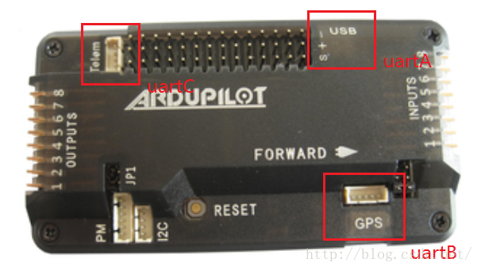

# APM飞控学习之路：5 串口概述与收发调试

2016年11月23日 20:11:23 [岳小飞Fly](https://me.csdn.net/u010682510) 阅读数：12718更多

个人分类： [四旋翼无人机](https://blog.csdn.net/u010682510/article/category/6495885)

版权声明：本文为博主原创文章，未经博主允许不得转载。 https://blog.csdn.net/u010682510/article/details/53310691

        “云中谁寄锦书来，雁字回时，月满西楼”。当无人机在空中飞翔时，从APM飞控到飞手之间有几条看不见的“风筝线”——（1）2.4GHz的遥控；（2）433/915MHz的数传；（3）5.8GHz的图传；（4）osd（on-screen display）。其中遥控是大家最为熟知的，用于控制飞行和切换模式。数传说白了是一个披着射频的皮的无线串口，波特率57600，连接地面站可实时观测飞行数据和在线调参。图传是FPV（First Person View）必备，传输视频信号用于航拍。osd是锦上添花的部件，将飞行数据叠加到视频信号上一起传回地面接收机。

  

        遥控、图传和osd都是很成熟的产品，对于开源用户来说定制性不强，而数传可以传回用户感兴趣的任何数据以及在线调参，实为居家必备之良品。如果选购与APM适配的3DR数传，无需任何修改，插上APM即可在地面站（Mission Planner）监测无人机的飞行数据。从功能上看，数传与下载程序兼具串口功能的USB线别无二致，只是形态上有线无线而已。二者的技术基础是串口以及基于串口的Mavlink通信，本文主要讨论如何使用APM中的串口并进行二次开发。

  

# APM2.8串口概述


        串口的英文名是UART，全称Universal Asynchronous Receiver/Transmitter，即通用异步接收/发送机，只要一对传输线（RX-TX）即可实现双向通信。串口通过USB转TTL模块可插在电脑的USB口，在设备管理器上体现为COM口，是单片机调试和通信的重要接口。


        对于APM2.8飞控，其主控芯片为Atmega2560，有4个串口，分别为UART0~UART3，在APM中起作用的只是前3个，即UART0、UART1和UART2。UART0接USB，UART1接GPS，UART2接数传。



        APM3.2.1源码为适应除APM之外的不同硬件（如PIXHAWK），在硬件抽象层HAL（Hardware Abstraction Layer）提供了通用的外设接口。在HAL.h中可以查看HAL类的声明，串口方面保留了\_uartA~\_uartE共5个。  

```cpp
class AP_HAL::HAL {public:    HAL(AP_HAL::UARTDriver* _uartA, // console        AP_HAL::UARTDriver* _uartB, // 1st GPS        AP_HAL::UARTDriver* _uartC, // telem1        AP_HAL::UARTDriver* _uartD, // telem2        AP_HAL::UARTDriver* _uartE, // 2nd GPS        AP_HAL::I2CDriver*  _i2c,        AP_HAL::SPIDeviceManager* _spi,        AP_HAL::AnalogIn*   _analogin,        AP_HAL::Storage*    _storage,        AP_HAL::UARTDriver* _console,        AP_HAL::GPIO*       _gpio,        AP_HAL::RCInput*    _rcin,        AP_HAL::RCOutput*   _rcout,        AP_HAL::Scheduler*  _scheduler,        AP_HAL::Util*       _util)        :        uartA(_uartA),        uartB(_uartB),        uartC(_uartC),        uartD(_uartD),        uartE(_uartE),        i2c(_i2c),        spi(_spi),        analogin(_analogin),        storage(_storage),        console(_console),        gpio(_gpio),        rcin(_rcin),        rcout(_rcout),        scheduler(_scheduler),        util(_util)    {}     virtual void init(int argc, char * const argv[]) const = 0;     AP_HAL::UARTDriver* uartA;    AP_HAL::UARTDriver* uartB;    AP_HAL::UARTDriver* uartC;    AP_HAL::UARTDriver* uartD;    AP_HAL::UARTDriver* uartE;    AP_HAL::I2CDriver*  i2c;    AP_HAL::SPIDeviceManager* spi;    AP_HAL::AnalogIn*   analogin;    AP_HAL::Storage*    storage;    AP_HAL::UARTDriver* console;    AP_HAL::GPIO*       gpio;    AP_HAL::RCInput*    rcin;    AP_HAL::RCOutput*   rcout;    AP_HAL::Scheduler*  scheduler;    AP_HAL::Util*       util;};
```

        落实到APM2.8飞控板上，从HAL\_AVR\_APM2_Class.cpp中可以查看串口的对应关系，同样可以得出只用了前3个，且UART0接USB，UART1接GPS，UART2接数传。源码与飞控板，一个底层，一个上层，“默契”地达成了一致。

```cpp
HAL_AVR_APM2::HAL_AVR_APM2() :    AP_HAL::HAL(        &avrUart0Driver, /* phys UART0 -> uartA */        &avrUart1Driver, /* phys UART1 -> uartB */        &avrUart2Driver, /* phys UART2 -> uartC */        NULL,            /* no uartD */        NULL,            /* no uartE */        &avrI2CDriver,        &apm2SPIDriver,        &avrAnalogIn,        &avrEEPROMStorage,        &avrUart0Driver,        &avrGPIO,        &apm2RCInput,        &apm2RCOutput,        &avrScheduler,        &avrUtil ){}
```

        如果大家仔细观察上面APM2.8的方框图，可以发现数传和USB接口都是走的UART0，这是为何？因为APM2.8采用了一种MUX复用的方式，使得当数传与USB同时接上的时候，USB会把数传屏蔽，即UART0占主导地位。在此祭出硬件原理图，TS5A23157是一个模拟开关，3DR代表数传。当USB和数传同时接上时，模拟开关会将3DR\_RX与RX0接上，3DR\_TX与TX0接上，即串口0把数传给屏蔽了。


# 串口源码分析

  

        一个串口要发挥作用，首先需要初始化，即配置波特率、设置起始位等操作。对于STM32单片机（用于PIXHAWK），还有串口中断等配置。APM中的Arduino单片机比较简单，只需配置好波特率，其余保持默认即可。

        Arduino程序的初始化，一般在setup()函数中。不出所料，串口的初始化也在其中，见ArduCopter.pde的setup()函数，可以看到初始化函数init_ardupilot()。

```cpp
void setup() {    cliSerial = hal.console;     // Load the default values of variables listed in var_info[]s    AP_Param::setup_sketch_defaults();     // setup storage layout for copter    StorageManager::set_layout_copter();     init_ardupilot();     // initialise the main loop scheduler    scheduler.init(&scheduler_tasks[0], sizeof(scheduler_tasks)/sizeof(scheduler_tasks[0]));}
```

        在Visual Studio+VMICRO的环境下，按F12或鼠标右键可转到init\_ardupilot()的定义，在system.pde的init\_ardupilot()中摘出与uartA有关的代码以便分析。  

```cpp
hal.uartA->begin(map_baudrate(g.serial0_baud), 512, 128);， //gcs[0].init(hal.uartA); hal.uartA->set_blocking_writes(false);
```

        第1行和第3行很好理解，分别是uartA设置波特率（115200）和非阻塞模式，第2行的gcs\[0\]容易让人迷惑。gcs的全称为Ground Control Station，即地面工作站。再转到gcs的定义，可发现其数据类型为GCS_MAVLINK，由此可断定该行代码的作用是绑定Mavlink和uartA，将数据以Mavlink协议与地面站通信。为单独测试串口收发，可取消uartA与Mavlink的绑定，即注释掉gcs所在行的代码。

  

# 串口数据收发


        初始化搞定之后，就可以进行简单的串口收发测试——串口助手发数据给飞控，飞控返回原数据。串口的接收一般有2种方式：查询或中断。Arduino中的串口中断函数为SerialEvent，是一种软中断，博主将Arduino nano板中测试通过的串口中断代码移植到APM源码中，发现并不起作用。原因尚不明确，或许 APM板本身并不支持，也可能是博主移植的地方不合适。期待有心人进行尝试，欢迎留言讨论。  
        为了推进测试进程，转向查询方式。有2种方式：1.在ArduCopter.pde的fast\_loop中查询；2.在UserCode.pde中添加代码。如果要使用UserCode.pde，需在ArduCopter.pde添加相应的宏，才能将UserCode.pde加入编译。为了方便，博主在fast\_loop()中添加串口接收查询代码：  

```cpp
static void fast_loop(){     // IMU DCM Algorithm    // --------------------    read_AHRS();     // run low level rate controllers that only require IMU data    attitude_control.rate_controller_run();    #if FRAME_CONFIG == HELI_FRAME    update_heli_control_dynamics();#endif //HELI_FRAME     // write out the servo PWM values    // ------------------------------    set_servos_4();     // Inertial Nav    // --------------------    read_inertia();     // 串口接收查询 by--岳小飞    while (hal.uartA->available())    {         uint8_t data = (uint8_t)hal.uartA->read();         hal.uartA->write(data);    }     // run the attitude controllers    update_flight_mode();     // optical flow    // --------------------#if OPTFLOW == ENABLED    if(g.optflow_enabled) {        update_optical_flow();    }#endif  // OPTFLOW == ENABLED }
```

        打开串口，APM飞控会发出一串提示字符，包括版本信息，如“Init ArduCopter V3.2.1”。博主发送“YueXiaoFei”，飞控原样返回，测试通过。基于这个简单的收发测试，大家可自定义数据协议，发送和接收感兴趣的飞行数据，也可学习基于串口的Mavlink协议。


        PS：无人机系列的第5篇至此结束，系列博客也随之告一段落。就应用方面而言，从入门到编译，从编译到调试，博主尽可能地将问题讲清楚，所有资料免积分下载，也算是为开源贡献自己的一份力吧。博客中可能存在一些小错误，也欢迎大家在评论区批评指正。力有不逮，敬请见谅~

---------------------------------------------------


原网址: [访问](https://blog.csdn.net/u010682510/article/details/53310691)

创建于: 2019-05-18 15:47:56

