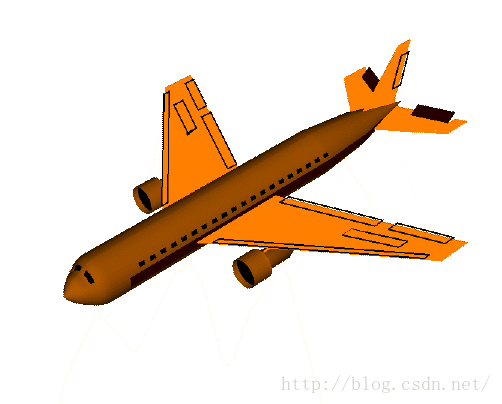
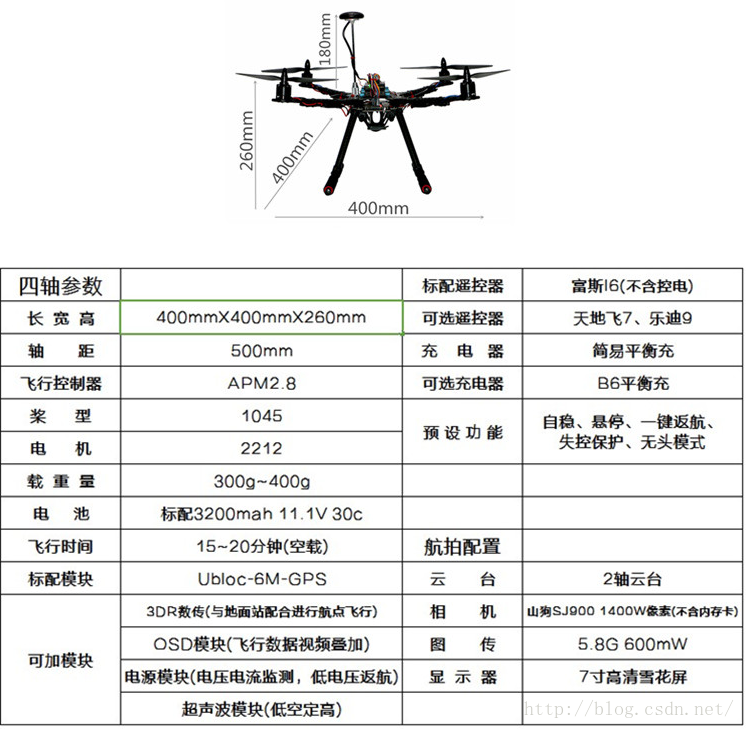
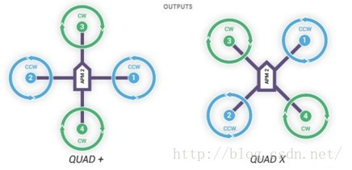
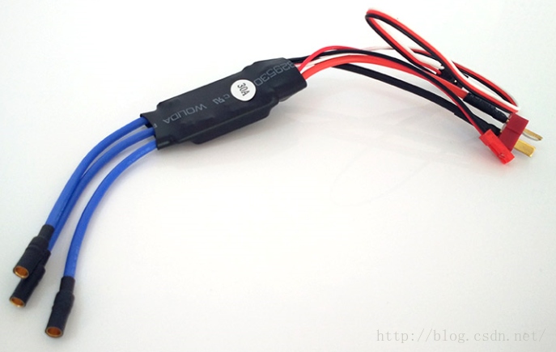
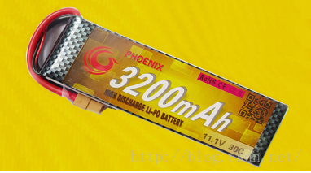

# APM飞控学习之路：2 四旋翼的工作原理与系统组成

2016年10月31日 20:48:47 [岳小飞Fly](https://me.csdn.net/u010682510) 阅读数：12001

版权声明：本文为博主原创文章，未经博主允许不得转载。 https://blog.csdn.net/u010682510/article/details/52986472

        “一叶障目，不见泰山”。在研究四旋翼飞行器之前，有必要从整体介绍其工作原理、主要部件、技术名词等基础知识。不然就像羊入虎口，陷入一大堆不同层次的资料，难觅出口。接下我就抛砖引玉，尽自己所能，介绍四旋翼的工作原理和主要部件。余虽不敏，然余诚也。

  

# 工作原理

  

        四旋翼飞行器，通过4个对称布置的电机，改变螺旋桨的转速，实现升力的变化，进而控制飞行器的姿态和位置。姿态具体指3个欧拉角：横滚（Roll）、俯仰（Pitch）、偏航（Yaw）。位置具体指1个高度油门（Throttle）和2个位置（X和Y）。欧拉角是一种描述物体姿态的常见方式，广泛应用于惯性导航、机器人等领域。为了方便大家理解，在网上找了3个欧拉角的动图，分别为Roll、Pitch、Yaw，让我们致敬制作者3秒钟。

        横滚：Roll，控制四旋翼左右运动。  

        俯仰：Pitch，控制四旋翼前后运动。  

        偏航：Yaw，控制四旋翼的朝向。  

        无人机的姿态和位置共有6个自由度，每个自由度的控制如下图所示。4个电机2个正转（电机2和4），2个反转（电机1和3），对称布置。电机正反转配合正反桨，可使螺旋桨的风都往下刮以平衡重力，同时抵消因桨叶旋转带来的空气阻力扭矩。由于输入只有4个自由度，因此多出的2个自由度是不完全受控的，其中俯仰运动和前后运动耦合，滚转运动和侧向运动耦合。

  

        坐标系：标准右手系。规定X轴正方向为前向。螺旋桨的箭头向上↑：电机转速上升。螺旋桨的箭头向下↓：电机转速下降。

        (a) 垂直运动（Throttle）：4个电机均加大马力，螺旋桨产生的升力大于重力，飞机便垂直上升。当升力与重力平衡时，飞机便悬停。悬停是考验算法的重要一环，靠的是PID不断反馈，调整转速。

        (b) 俯仰运动（Pitch）：电机1加大马力，电机3减小马力，二者的变化量相同。1处升力变大，3处升力减小，重力仍保持平衡，但对Y轴产生一个力矩，机身绕Y轴旋转，实现俯仰。

        (c) 滚转运动（Roll）：与 (b) 原理相同，只是Y轴换成了X轴。

        (d) 偏航运动（Yaw）：电机1、3加大马力，电机2、4减小马力，二者的变化量相同。重力和绕X、Y轴的扭矩仍保持平衡，但要注意的是，根据作用力和反作用力原理，由于2个正转的速度>2个反转的速度，空气阻力产生的扭矩不平衡了，使得机身绕Z轴旋转，实现偏航。

        (e) 前后运动：与 (b) 耦合，机身绕Y轴旋转一定角度后，使得升力沿水平方向有了分量，实现前后运动。

        (f) 侧向运动：与 (c) 耦合，原理与 (e) 相同。

        如果有朋友接触过麦克纳姆轮，也称“全向轮”，那就更容易理解四旋翼的工作原理了。麦克纳姆轮通过4个对称布置的电机和轮盘，可实现车身水平任意方向的移动和原地旋转，无比灵活。  

  

  

# 主要部件

  

  

        以S500为例，S500是一架入门级的四旋翼飞机，这里的500指的是轴距（对角2个电机之间的距离），单位 ：mm。对于开源爱好者而言，如果想一站式玩四旋翼，在某宝上选购一架S500是个不错的选择。下面我就从上表出发，详细介绍四旋翼的主要部件和技术名词。

## 四旋翼本体

        四旋翼分2种模式，1种是+模式：飞行方向（机头）与旋翼重合；1种是X模式：飞行方向（机头）平分旋翼。

        +模式：直观，简单，驱动弱，调参容易。

        X模式：复杂，稳定，驱动好，调参麻烦。

        对于四旋翼，稳定和驱动是第一位的，调参可以站在巨人的肩膀上，因此一般采用X模式。  

  

## 飞行控制器

        飞行控制器简称飞控，是无人机的大脑。目前主要分开源和闭源两派，开源飞控的鼻祖来自Arduino，著名的WMC飞控和APM飞控都是Arduino飞控的直接衍生品，APM全称ArduPilotMega，其中的Ardu代表的就是Arduino。APM飞控是目前成熟度最高的开源飞控，但由于容量和计算量有限，在不久的将来一定会被更强大的PIX4、PIXHAWK所超越，成为一个时代的缩影。还有一些较为初级的飞控，如KK、QQ、玉兔等，在这就不赘述了。闭源飞控主要由商业公司推出，如DJI的工业级飞控A2、A3，入门级飞控Naza系列，还有零度的S4、X4和双子星GEMINI。值得一提是其中的双子星，是国内首个双余度安全飞行控制系统。随着安全性的重视和提高，冗余度设计也将成为无人机的标配。  

  

## 螺旋桨

        4个螺旋桨，2正桨（顺时针转）2反桨（逆时针转），正反桨的风都向下吹，正反的目的主要是抵消螺旋桨的自旋。安装的时候，无论正反桨，有字的一面均向上。桨型中1045这4位数字，前2位10代表桨的直径（单位：英寸inch），后2位45代表桨的角度（单位：度°）。  

  

## 电机

        4个无刷电机，2正转2反转。2212这4位数字，前2位22代表电机转子直径，后2位12代表电机转子高度，单位：毫米mm，注意均指电机转子而非外壳。如果大家留心的话，电机外壳上一般会并注明这4位数字，除此之外，还会看到一个KV值，代表外加1V电压时电机每分钟空转转速。如“KV:900”代表外加1V电压时，电机空转时每分钟转900圈。常见的电机品牌有新西达（XXD）、朗宇（SunnySky）等，并且很多外壳上会有一串神秘字符：MADE IN CHINA。  

  

## 电调

        说完电机说电调，电调和电机配套使用，是飞控和电机之间的桥梁。电调全称电子调速器（Electronic Speed Control），负责将飞控的控制信号（PWM波）转变为电流的大小，进而控制电机转速。除了明面上的转换功能，还能承载电机所需的大电流，以及将11.1V转为5V供飞控和遥控模块使用（BEC输出）。电调的主要参数是电流输出能力，单位A，如30A代表电调能提供的最大电流为30A。常见的电调品牌有新西达（XXD）、中特威（ZTW）、好盈（HobbyWing）等。

  

## 电池

        一般为锂电池，因为同等电池容量锂电池最轻。大家可以看到有3个参数：3200mAh 11.1V 30c。和手机电池一样，3200mAh代表以3200mA电流放电，可持续1小时。11.1V代表电压，一般由3节标准锂电池组成（3.7V×3=11.1V），相应标识为3S。30c代表放电能力，在航模中是个重要参数，意味着可以3200mA×30的电流强度放电。说完了放电，还有充电，一般为2c充电，即充电电流可为3200mA×2。由于航模锂电池采用多节标准锂电池组成，而各节标准锂电池之间存在充放电性能差异，因此充电器一般采用平衡充，避免某节电池过充。  

  

## 遥控器

        主要分美国手和日门手，美国手的油门在左边，日本手的油门在右边。在四旋翼的控制中，一般采用美国手。怎么判断油门呢？很简单，遥控器左右2个摇杆中，推上去不回弹的是油门。也很好理解，油门一般稳定在一个位置就好了，回弹的话飞手会流泪。遥控器中也有1个神秘数字，6代表6通道，即遥控器可控的动作路数。因为四旋翼有4个自由度，所以遥控器至少需要4通道，剩余的通道用于控制飞行模式等。  

  

        至此四旋翼的主要部件和技术名词介绍完毕，还有一些可选部件，如数传、OSD、云台、相机、图传等，待大家入门后即可自行挖掘。最后附上一个Exciting的TED视频，震撼你的眼球。[拉菲罗·安德烈:四轴飞行器灵活的运动性](http://v.youku.com/v_show/id_XNzMyNjc2NjAw.html)。  

        PS： 无人机系列的第2篇至此结束，接下来就会进入正题——APM飞控。欲知后事如何，且看下回分解。

---------------------------------------------------

原网址: [访问](https://blog.csdn.net/u010682510/article/details/52986472)

创建于: 2019-05-18 15:46:46

