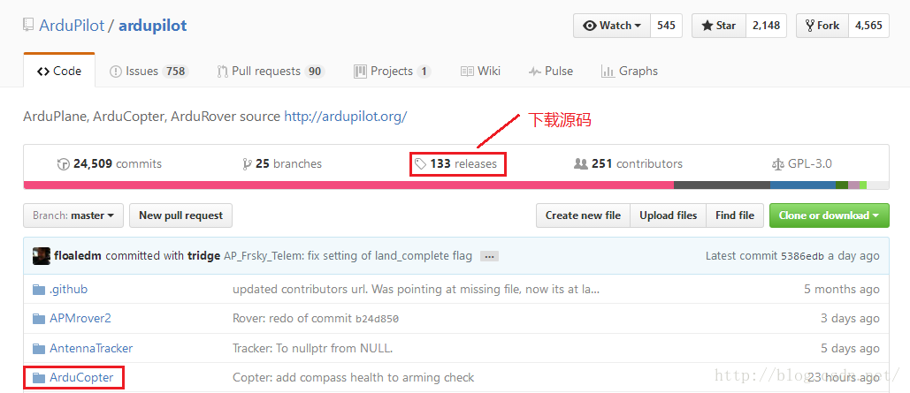
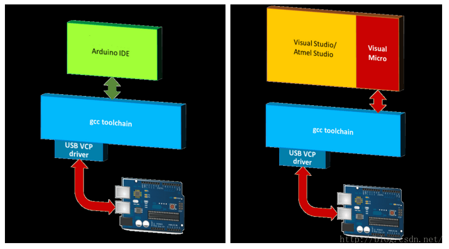
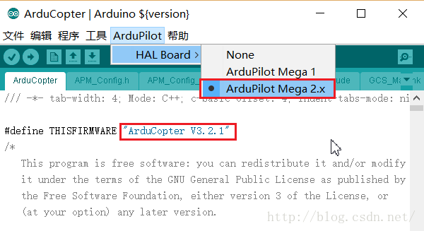
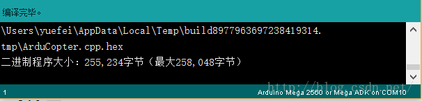
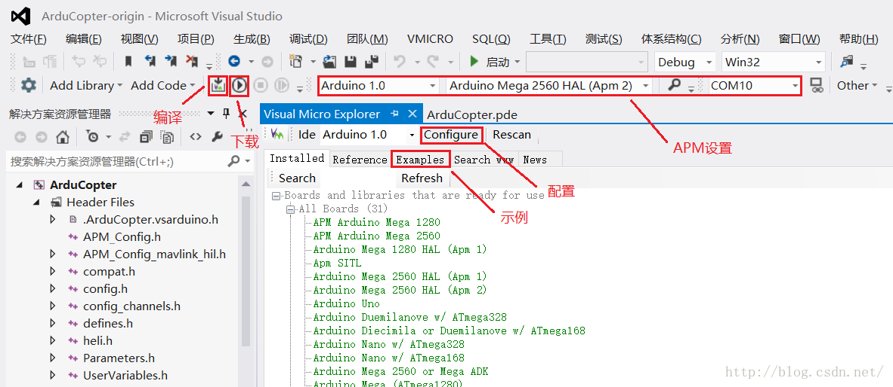
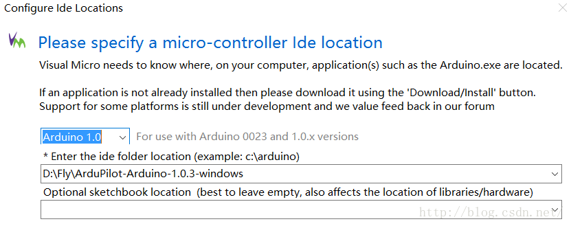
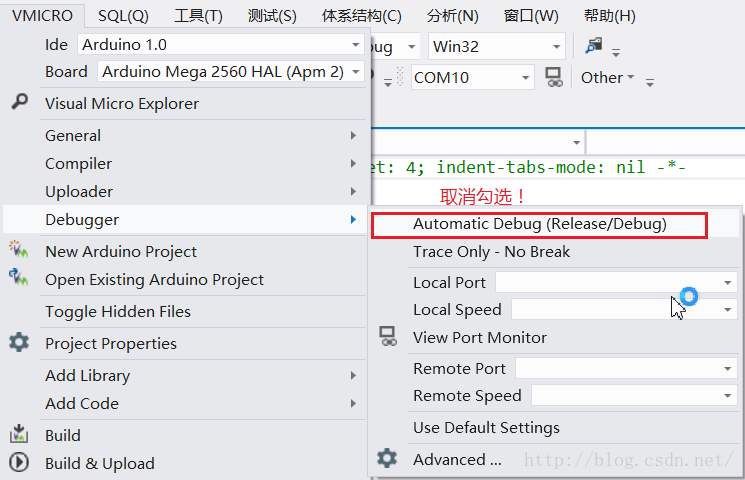
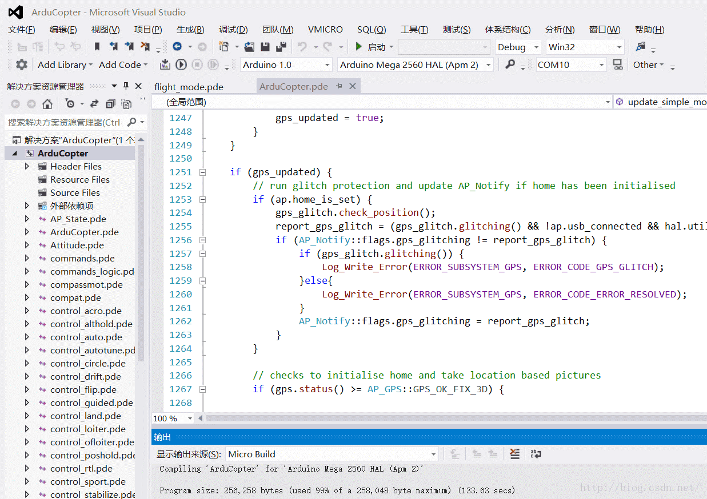

# APM飞控学习之路：3 APM系统介绍与开发环境搭建

置顶 2016年11月03日 11:08:55 [岳小飞Fly](https://me.csdn.net/u010682510) 阅读数：43807

版权声明：本文为博主原创文章，未经博主允许不得转载。 https://blog.csdn.net/u010682510/article/details/53019637

        “工欲善其事，必先利其器”。在进行无人机飞控开发时，选择一个合适的软硬件平台以及IDE是十分重要的。目前，APM飞控成熟度高，开发工具齐全，社区建设完善，开发者文档丰富，适合开源选手入门和二次开发。因此，本系列博客以APM飞控作为切入点，在Windows环境下介绍其代码结构和开发应用。

  

# APM系统介绍

  

        APM全称ArduPilotMega，Ardu源自Arduino，Pilot意指飞行，Mega代表主芯片为ATMEGA2560（Atmel公司的8位AVR单片机）。是的，没有看错，一个简单8位单片机竟完成了如此复杂的飞控任务！ 51单片机表示哭晕在厕所，同为8位出身，命运截然不同。笔者大概是2011年接触的单片机，当时也同大多数初学者一样，从经典的51单片机入门，一个个模块、寄存器的学习，曲线虽说不上陡峭，但至少不那么友好。反观Arduino，近3年在国内迅速崛起，除了Geek文化和开源文化的普及，一个很关键的原因在于Arduino让不懂硬件电路的普通人（甚至小学生）也能轻松上手硬件了。没有了烦人的寄存器，没有了纷繁的头文件，一个setup()和一个loop()，再加一个自带教程的简洁IDE，Arduino名副其实——源自意大利的男姓用名，意为“强壮的朋友”。世界如此美好，我想和Arduino做朋友。  

        APM内置六轴MEMS传感器MPU6000，气压计MS-5611，三轴磁力计HMC5883，一般还会配置GPS模块，以便更精确的惯性导航。其中，MPU6000整合了三轴陀螺仪和三轴加速度计，积分可得速度和位姿。MS-5611通过测量气压得到高度，辅助GPS定位。HMC5883通过测量地磁场得到方位，辅助无人机定向。飞控采集并融合多种传感器的数据，计算并校正无人机的位姿。给APM一张正面裸板特写！  

  

# APM与PIXHAWK的关系        

        说到APM，就不得不提它的进化版：PX4和PIXHAWK，来自苏黎世联邦理工大学。“PX4是一个软硬件开源项目（遵守BSD协议），目的在于为学术、爱好和工业团体提供一款低成本、高性能的高端自驾仪。PX4FMU自驾仪模块运行高效的实时操作系统（RTOS），Nuttx提供可移植操作系统接口（POSIX）类型的环境。由3DR联合APM小组与PX4小组于2014年推出的PIXHAWK飞控是PX4飞控的升级版本，拥有PX4和APM（ArduPilot）两套固件和相应的地面站软件，也是目前全世界飞控产品中硬件规格最高的产品。”

        好了说人话，目前主流就2种：**APM**和**PIXHAWK。**有时指硬件，有时指软件（固件），为了明确，在此做个区分。**硬件分2种：APM和PIXHAWK。**APM的版本有2.5，2.6和2.8，PIXHAWK的版本有v1和v2。**软件也分2种：APM和PX4。**软件版本就多了去了，详见github。APM硬件由于存储空间有限，最高支持到3.2.1的APM软件。PIXHAWK硬件是STM32F4，存储空间大，对APM软件（3.2.1之后的版本也支持）和PX4都支持。

        APM和PIXHAWK都开源，不过二者遵守的开源协议不同。APM多用于DIY和小型产品，某宝上大量的无人机就采用APM，成本低。公司商用一般采用PIXHAWK。目前很多PIXHAWK里跑的还是APM固件，个人认为有几大原因：1. APM固件出来的更早，使用人群习惯的延续；2. APM固件成熟度更高、资料更全。3. APM固件走开源路线更彻底，遵守GPL V3协议，PX4更倾向商业和实验用途，遵守BSD协议。目前APM小组已和PX4小组分道扬镳，详见新闻：[ArduPilot脱离Dronecode真相](http://mt.sohu.com/20161019/n470650680.shtml)。  

# APM固件下载

  

        刚提到APM硬件的最高版本为2.8，现在说说APM固件（源码）的版本。既然是开源项目，那么在github上肯定有仓库。曾经的APM源码存于code.google.com，后来github席卷全球，成为广泛接受的代码仓库，于是谷歌把自己的仓库关了（反正国内也上不去:-(）。github上的源头在此：[https://github.com/ArduPilot/ardupilot](https://github.com/ArduPilot/ardupilot)。其中的ArduCopter支持多旋翼、直升机等，四旋翼源码即在其中，但是别急着下载，先点击release看看源码版本。可以看到带Copter的最新版本是“Copter-3.4.0”，带ArduCopter的最新版本是“ArduCopter-3.2.1-apm-px4”，很多朋友直接参照网上的《通过Arduino给APM编译下载最新固件》用git克隆代码到本地，发现无法使用，问题就在于git获取的是最新版，而APM支持的最高版本是“ArduCopter-3.2.1-apm-px4”，从命名也可以发现，该版本固件同时支持APM和PX4。  

  

        获取ArduCopter-3.2.1版本的源码有2种方式：I. 在github页面点击release，往下翻几页，找到“[ArduCopter-3.2.1-apm-px4](https://github.com/ArduPilot/ardupilot/releases/tag/ArduCopter-3.2.1-apm-px4)”下载即可。II. 喜欢git的朋友在克隆最新代码后，也可以回退到3.2.1的版本，与第一种方法获得的源码无异。

```php
git clone https://github.com/ArduPilot/ardupilot.git
cd ardupilot/
git branch -a
git checkout -b arducopter-3.2.1 origin/ArduCopter-3.2.1
```

        使用方法解压之后就可以看到源码啦，结构如下。其中，APMrover2支持地面车辆，ArduPlane支持固定翼，ArduCopter支持多旋翼和直升机。对于四旋翼的开发，就对应ArduCopter文件夹。值得一提的是，打开ArduCopter文件夹后，可以看到一大波.pde文件，.pde为Arduino文件的旧版后缀，新版的为.ino（Arduino的后3个字母），可以简单类比成.cpp文件。熟悉C++的朋友可能会想去找main文件，这回改头换面了，主文件叫ArduCopter.pde。


  

# APM开发环境

  

        巧妇难为无米之炊”，现在米有了，用什么工具做饭呢。先把火备好，即编译的[工具链和驱动](http://download.csdn.net/detail/u010682510/9671815)：MHV\_AVR\_Tools_20121007.exe（AVR单片机编译和下载程序用）和MissionPlanner-latest.msi（飞控地面站，含APM的USB接口驱动）。接下来就是用什么灶台做饭了，以Windows平台为例，灶台根据方便程度有2种：I. 土灶：[ArduPilot-Arduino-1.0.3-gcc-4.7.2-windows](http://pan.baidu.com/s/1eS4wHSe)（为ArdupPilot定制的Arduino IDE）。II. 电磁炉：Visual Studio配合Visual Micro插件（Arduino for Visual Studio插件）。二者本质没有区别，可以看到都是调用gcc工具链，Visual Studio只是通过Visual Micro在上层封装了操作接口，便于程序员查看和编写代码。**强烈建议使用Visual Studio！！！**  

**  
**

## 环境I（轻量）. Arduino IDE

  

        先介绍Arduino派的IDE：ArduPilot-Arduino-1.0.3-gcc-4.7.2-windows，此IDE不同于普通的Arduino IDE，而是为**ArdupPilot定制**的。解压之后，打开“arduino.exe”，一张白板扑面而来。唯一和飞控有关的就在菜单栏上，相比通用ArduinoIDE多了“ArduPilot”一项。工具栏的“√”是编译，“→”是下载。

  

        点击“文件->参数设置”，可设置程序库的位置，即APM源码位置，注意不要勾选“启动时检查更新”，因为本IDE专为ArduPilot定制。其他选项可根据个人喜好设置。  

  

        设置完成后退出再重开，以保证程序库位置生效。点击“文件->程序库->ArduCopter”，源代码一览无余。之后配置APM固件，主芯片：“工具->板卡->Arduino Mega 2560 or Mega ADK”，串口：“工具->串口->相应USB串口”（确保驱动已安装），编程器：“工具->编程器->AVRISP mkll”（默认），APM硬件型号：“ArduPilot->HALBoard->ArduPilot Mega 2.x”。  

  

  

        至此，Arduino IDE的完毕，可以点击编译了。等待3分钟左右，编译完毕，生成一个hex文件用于下载到APM板。

  

        切记：**不要下载！不要下载！不要下载！下载会变砖！**

## 环境II（推荐）. Visual Studio&Visual Micro

##   

        Arduino IDE编译APM的代码还可以，但要是用来浏览和编写代码，那就是千丝万缕扭不清了，所以ArduinoIDE的设置里也机智地留下一条后路：“□使用外部编辑器”。  

        Visual Studio（以下简称VS）作为宇宙最强IDE，怎么能不支持下Arduino，感谢微软救民于水火。以VS2012为例，点击“工具->扩展和更新->联机”，搜索“Visual Micro”，下载安装即可。顺便推荐下Visual Assist，VS下最好的代码补全工具，以前写1行代码的功夫，现在可以写3行~  

  

        安装好之后，VS的菜单栏多了一些振奋人心的东西。“VMICRO”中可设置Arduino的选项，点击“VMICOR->Visual Micro Explorer”，如下图所示。对比Arduino IDE可发现，编译、下载、COM口应有尽有，还可适配不同的Arduino 版本。  

  

        点击“Configure”进行配置，选择Arduino版本：1.0，配置Arduino目录，笔者的是：D:\\Fly\\ArduPilot-Arduino-1.0.3-windows，即ArduPilot-Arduino-1.0.3-gcc-4.7.2-windows解压后的文件夹。**注意此插件的名字是“Arduino IDE for Visual Studio”，并不是专为Ardupilot/APM定制，因此还需适配[apm硬件信息](http://download.csdn.net/detail/u010682510/9671800)（点击蓝字链接下载，解压后为一名为apm的文件夹，内仅含boards.txt）。将该apm文件夹放入D:\\Fly\\ArduPilot-Arduino-1.0.3-windows\\hardware中。**配置完成之后，可在“Installed”选项卡中查看支持的硬件类型，如所需的“Arduino Mega 2560 HAL (Apm 2)”，插上APM后在COM口选择对应的串口号。此外，在“Examles”选项卡中可查看Arduino和ArduCopter的例程。

  

        重启VS，点击“文件->打开->Arduino Project”，选择ArduCopter文件夹中的ArduCopter.pde打开，即可在“解决方案资源管理器”中看到APM的源码结构。解释一下，ArduCopter.pde相当于平时常见的Main.cpp，在ArduCopter.pde的最后一行是真正的main函数。  

```cpp
AP_HAL_MAIN();
```

        除此之外，有一点需要注意，**在“VMICRO”中，“Debugger”取消勾选“Automatic Debug（Release/Debug）”**，否则会编译失败。因为APM2.8不支持在线Debug，同时对于“多线程”程序，Debug本身意义不大，一般采用串口print进行调试以便观察程序流程。对于普通Arduino板（如nano）可以勾选，下载后会自动进入调试状态。

  

        至此，Visual Studio&Visual Micro的配置完毕，又可以愉快地编译了。同样等待大概3分钟左右，可以看到编译完成，生成一个hex文件用于下载到APM板。对于编译，第1次会较慢，修改代码再次编译就很快了。

  

        切记：**不要下载！不要下载！不要下载！下载会变砖！**  

        在此给出笔者用VS2012编译的工程：[APM3.2.1固件-VS2012工程](http://download.csdn.net/detail/u010682510/9673200)，打开ArduCopter文件夹中的ArduCopter.sln即可使用。如果你好奇心太重点了下载，也没关系，笔者会在下一篇博客让板砖起死回生:)

  

# APM资料说明

  

        有关APM的资料，首推ArduPilot官网：[http://ardupilot.org/ardupilot/](http://ardupilot.org/ardupilot/)。如果是开发四旋翼，左侧的“Copter”和“Developers”是你经常要去逛的。里面详细介绍了APM的方方面面，值得反复咀嚼。网上的APM资料，很多就是翻译自ArduPilot官网，但是良莠不齐。不要惧怕英文而选择逃避，蔡康永有一段很有名的话，“15岁觉得游泳难，放弃游泳，到18岁遇到一个你喜欢的人约你去游泳，你只好说"我不会耶”。18岁觉得英文难，放弃英文，28岁出现一个很棒但要会英文的工作，你只好说“我不会耶”。人生前期越嫌麻烦，越懒得学，后来就越可能错过让你动心的人和事，错过新风景。”万事开头难，但也不要放大开头的困难，跨过去就好了。  

  

        国内的资料，主要推荐“模友之吧”里“泡泡老师”的视频教程，教你一步步上手APM2.8：[\[泡泡老师教程\] 新手课堂：APM2.8的使用方法](http://www.moz8.com/thread-36165-1-1.html)。  

        个人收集的2个资料：[新编APM-2.8.0中文入门手册](http://download.csdn.net/detail/u010682510/9671035)和[APM2.8接口介绍](http://download.csdn.net/detail/u010682510/9671039)。

        PS：无人机系列的第3篇至此结束，主要介绍了APM的固件和开发环境搭建，至于为何“不要下载！”，且看下回分解。

---------------------------------------------------


原网址: [访问](https://blog.csdn.net/u010682510/article/details/53019637)

创建于: 2019-05-18 15:47:14

