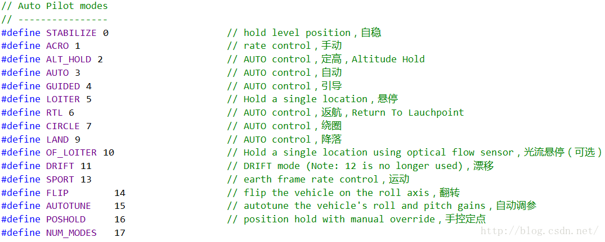
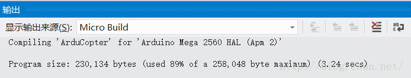

# APM飞控学习之路：4 源码裁剪与下载

2016年11月10日 21:20:56 [岳小飞Fly](https://me.csdn.net/u010682510) 阅读数：15610 标签： [无人机 APM 源码裁剪 程序下载 bo](https://so.csdn.net/so/search/s.do?q=%E6%97%A0%E4%BA%BA%E6%9C%BA%20APM%20%E6%BA%90%E7%A0%81%E8%A3%81%E5%89%AA%20%E7%A8%8B%E5%BA%8F%E4%B8%8B%E8%BD%BD%20bo&t=blog) 更多

个人分类： [四旋翼无人机](https://blog.csdn.net/u010682510/article/category/6495885)

版权声明：本文为博主原创文章，未经博主允许不得转载。 https://blog.csdn.net/u010682510/article/details/53121462

        “月盈则亏，水满则溢”。当博主编译完成，以为离成功更近一步准备下载的时候，殊不知陷阱也早已准备好，等待我的踏入。连上USB线，下载，timeout...，timeout...，timeout...，留下博主一脸懵逼，和一块已然变砖的APM板。遂作此文，为广大APM开发者避开下载的坑。

        下载环境：APM2.8，固件版本3.2.1，通过USB下载。

  

# 原因定位

  

        事出突然，案发现场只留下了一张截图，代表着下载失败。


        从这张截图开始分析：avrdude是AVR系列单片机的下载模块，负责将hex文件写入APM板的ROM和EEPROM。写入文件之后，avrdude向APM板Send数据，估计用于校验，却等不到回应：“programmer is not responding”，只能向电脑返回：timeout，顺便不忘问候博主：“avrdude done. Thank you.”  

        由此看来下载完程序之后，APM板直接变砖，已无法和PC端取得有效通信。博主经过多种尝试，如重新编译并下载、通过地面站（Mission Planner）刷固件、下载老版本固件，皆因timeout或无法连接而告终。痛定思痛，想到安卓手机刷机时也可能变砖，变砖后还能刷回来，靠的是什么？Bootloader！难道是因为程序过大，把APM板中的Bootloader，也就是引导程序给覆盖了？！  

  

        回过头来看编译结果：编译之后，程序大小为256258bytes，也就是250KB的样子，占用了总容量的99%！很可能把Bootloader给占用了。就好比把一个很大的文件往电脑的C盘塞，把C盘塞爆了，顺便把系统也弄崩了。果不其然，查阅资料可知，APM 程序存储容量为256KB，其中8KB被Bootloader占用。如果程序大于248KB，当程序烧写进APM中时，会破坏APM的Bootloader。Bootloader破坏之后的现象就是：APM板上电后只有电源灯亮，且无法连接地面站。正是如此！  

  

# 刷写Bootloader

  

        虽然Bootloader被博主无意中破坏，但天无绝人之路，从哪里弄坏，就从哪里修好。当自己买电子元器件和电路板，根据开源的APM硬件焊接APM板时，也需要给APM板重新烧写Bootloader。

## 硬件准备

        AVR单片机的USBASP或USBISP下载器×1。

## 软件准备

        1\. 下载器配套软件，推荐progisp1.72。

        2\. AVR的USB自编程软件：Flip。

        3\. 32u2的驱动程序。

        4\. 三个hex文件：Atmega2560的bootloader文件、32u2的bootloader文件和32u2的ppm程序文件。

        烧写过程概述：先给Atmega2560烧写bootloader，然后给Atmega32u2烧写bootloader，最后给32u2写入PPM解码通讯程序。  

        烧写的视频教程（含驱动和hex文件下载）：[\[泡泡老师教程\] 新手课堂，如何给修复或空板APM烧写 Bootloader](http://www.moz8.com/thread-36382-1-1.html)  

        烧写的文字教程：[烧写APM板的Bootloader](http://wenku.baidu.com/link?url=FeCEeDEweVtMLChCU7iUZtq8ry1d25ZhkFsWDyAAMHsKWm0-qyIew5brZVTHfyi9YPApl53lJ5kLeE4iJt622Z91XOP-s3KJ8pBbUC8aJGG)

        按照视频教程操作即可，可以不用转接线，直接用几根杜邦线连接，注意线序。

  

# 程序裁剪与下载

  

        既然程序容量有限，就需要对程序进行裁剪，比如拿剪刀把APM板剪掉一角。好了正经一点，所谓裁剪，最简单的就是将部分程序注释或删除，使编译之后的程序容量变小。要想裁剪APM，首先需要对飞控程序的结构有个大致的了解，才能在注释或删除代码的同时保证飞控的稳定性。先看看官网是怎么介绍飞控程序的：“The ArduPilot code base is quite large (about 700k lines for thecore ardupilot git tree) and can be quite intimidating to a new user.”，翻译过来就是飞控代码太太太多了，足足70万行估计你这小白搞不定。

        “他强任他强，清风抚山岗。他横由他横，明月照大江。”虽然飞控代码多，但是程序员有两板斧子，一看代码结构，二看主函数。

        根据上篇博文所述，使用VS2012配合VM插件查看APM3.2.1工程代码，其代码主要由多个pde文件组成，可简单理解为cpp文件。根据pde文件的命名，博主将代码分为6类：（1）主函数ArduCopter；（2）各种飞行模式，占了大部分程序，如control\_acro、control\_althold、control\_auto等；（3）系统初始化system；（4）Mavlink通信GCS\_Mavlink；（5）用户程序UserCode；（6）其他杂项。既然飞行模式的程序最多，博主就准备拿它开刀。

  

        要裁剪飞行模式，就得看主函数是如何调用各飞行模式的。看大型代码一定要带着目的去看，既然通过遥控可以切换飞行模式，那么判断处于飞行模式的代码一定是在某个循环中。这样一来就好办了，从ArduCopter.pde的fast_loop()函数入手，可以看到其代码不多，列出如下。

```cpp
static void fast_loop(){     // IMU DCM Algorithm    // --------------------    read_AHRS();     // run low level rate controllers that only require IMU data    attitude_control.rate_controller_run();    #if FRAME_CONFIG == HELI_FRAME    update_heli_control_dynamics();#endif //HELI_FRAME     // write out the servo PWM values    // ------------------------------    set_servos_4();     // Inertial Nav    // --------------------    read_inertia();     // run the attitude controllers    update_flight_mode();     // optical flow    // --------------------#if OPTFLOW == ENABLED    if(g.optflow_enabled) {        update_optical_flow();    }#endif  // OPTFLOW == ENABLED }
```

        细心的朋友可能注意到了，顾名思义，**update\_flight\_mode()**就是更新飞行模式的函数。右键转到定义或按快捷键F12，可查看**update\_flight\_mode()**中是一串熟悉的switch-case语句，根据不同的case切换不同的飞行模式。以常见的自稳模式stabilize为例，可一直追踪下去，如高度控制，电机控制等。醉翁之意不在酒，在乎“飞行模式”也。

  

        目前已了解飞行模式如何调用，那么裁剪也就很自然了——注释掉暂时不同的飞行模式。博主将APM所支持的飞行模式列举如下，用的最多的当属自稳STABILIZE和悬停LOITER，因此可将其他的一些飞行模式注释掉。博主所用S500无人机的遥控器为6通道，开关SWC拨到上为自稳模式，拨到中为悬停模式，因此博主在代码中只保留了自稳STABILIZE、定高ALT_HOLD、悬停LOITER和降落LAND共4种模式。

  

        将飞行模式裁剪后，重新编译代码，惊喜出现了，程序容量从99%降到了89%。现在自信地下载代码，成功！快给博主点个赞~

  

        温馨提示：下载源码不会改变APM中传感器的参数，如加速度计、罗盘等，其参数在APM板的EEPROM中，通过地面站的一系列校准步骤写入。有关地面站的使用，详见[新编APM-2.8.0中文入门手册](http://download.csdn.net/detail/u010682510/9671035)。  

        PS：无人机系列的第4篇至此结束，编译和下载终于告一段落，使用者至此可以愉快地二次开发了。说到开发就有调试，有关二次开发中利用串口调试的问题，且看下回分解。

---------------------------------------------------


原网址: [访问](https://blog.csdn.net/u010682510/article/details/53121462)

创建于: 2019-05-18 15:47:32

